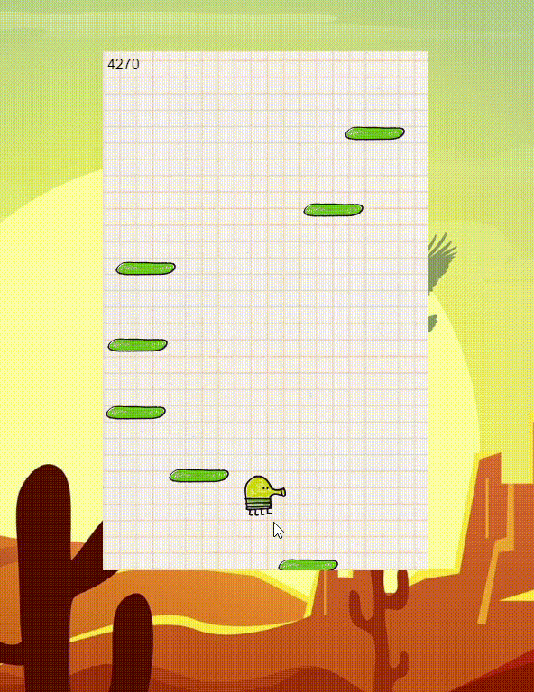

## To-Do list WebApp
Its a doodle jump game made using HTML , CSS and JavaScript 

## 🛠️ Description

In this game where we have to jump the doodle on the plateform and acquire the score . 

## ⚙️ Languages or Frameworks Used
   <ul>
     <li>HTML</li>
     <li>CSS</li>
     <li>JavaScipt</li>
   </ul>

## 🌟 Demo

