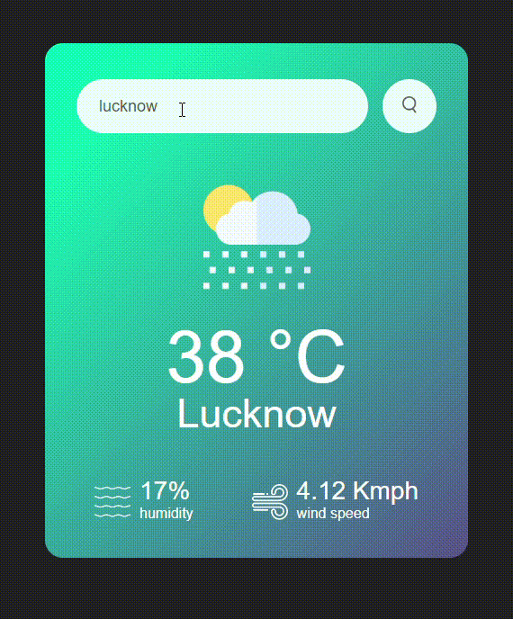

## weather WebApp
Its a weather webApp made using HTML , CSS and JavaScript

## 🛠️ Description

In this webApp where we can check the weather of any city all across the globe.  

<h5> Note : </h5>

 This project contain use of api to collect information of the current weather of evry city

wesite used to get api : <a href = "https://openweathermap.org/" >

## ⚙️ Languages or Frameworks Used
   <ul>
     <li>HTML</li>
     <li>CSS</li>
     <li>JavaScipt ( using API )</li>
   </ul>

## 🌟 Demo

